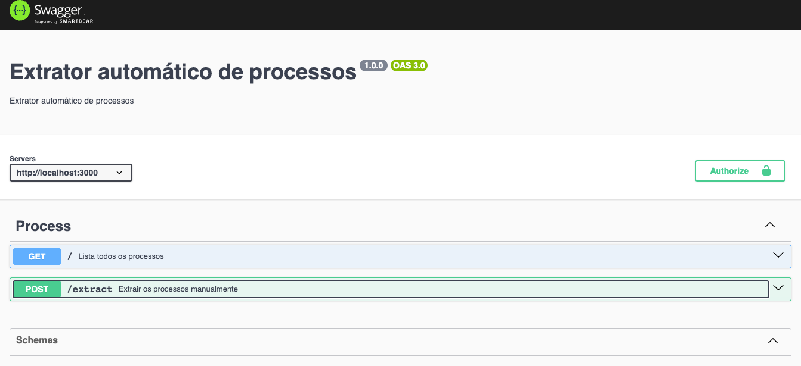

# Sobre
Este é um projeto para criar um sistema de extração automática de processos e itens licitatórios, o sistema extrai os processos quatro vezes por dia nos horários abaixo e salva as licitações no banco de dados MongoDB.
- 00:00h
- 06:00h
- 12:00h
- 18:00h

## 💻 Pré-requisitos

Antes de começar, verifique se você atende aos seguintes requisitos:

Você instalou o Docker e o docker-compose em sua máquina. Caso ainda não tenha instalado, você pode encontrar as instruções de instalação nos seguintes links:

- [Docker](https://docs.docker.com/get-docker/)
- [Docker Compose](https://docs.docker.com/compose/install/)

## 🚀 Instalação

Para instalar o projeto, siga estas etapas:

Clone o repositório do projeto para a sua máquina:
```
git clone https://github.com/DaywisonFerreira/process-extractor.git
```

Navegue até o diretório do projeto:
```
cd process-extractor
```

Execute o seguinte comando para iniciar o projeto usando o Docker Compose:
```
docker-compose up -d
```


## ☕ Uso

### Documentação API
Acesse o endpoint http://localhost:3000/swagger para interagir com a aplicação.


